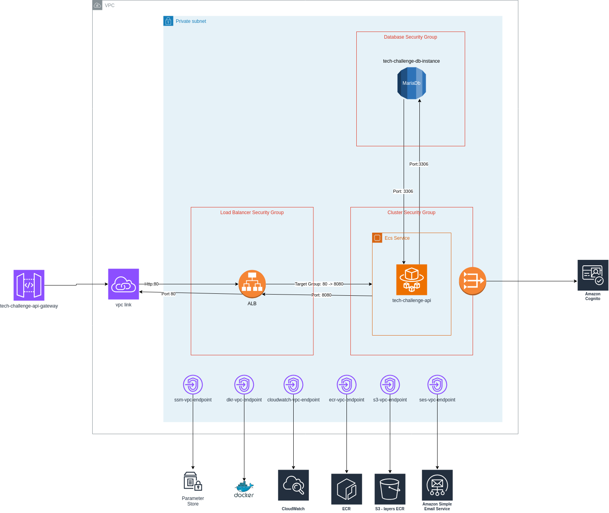

# tech-challenge-resources

Repositório com toda a infra necessária para subir uma instancia no fargate com conexão ao banco de dados MariaDb no RDS. Toda essa estrutura é criada em uma subnet privada na AWS. O acesso as rotas da api é feito exclusivamente pelo Api-Gateway

O repositório está configurado para realizar o plan da infra utilizando o terraform cloud no momento em que um PR é aberto e realizar o apply das alterações quando o PR for mergeado.

### Desenho técnico
O repositório cria a seguinte estrutura na AWS:
